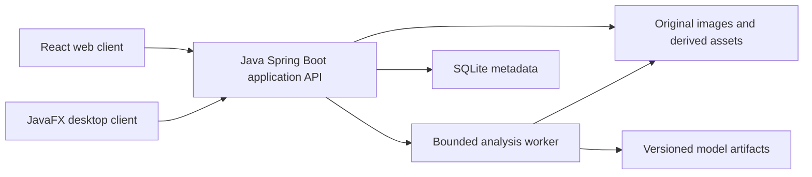

# Coregnition — Product Requirements Document

Status: implementation in progress. The local web manual workflow is implemented; desktop manual workflow and Linux application-folder packaging are implemented and verified on Linux/Xvfb. Recognition remains deferred pending labelled data.

Date: 2026-09-08

Source: [Initiative_coregnition.md](Initiative_coregnition.md)

## 1. Purpose and outcomes

Coregnition will help oil and gas geoscientists inspect geological core photographs, annotate depth intervals, and review machine-assisted lithology suggestions. Deliver both a web application and a Java desktop application using a consistent project format and analysis contract. The local web application is the first usable client; the Java desktop edition follows with feature parity after the shared API and manual workflow are stable.

The intended benefit is faster, more consistent core description with traceable expert decisions. Image predictions are interpretations requiring review. OpenCV supplies image-processing tools; it does not by itself supply a trained geological classifier. Recognition feasibility must be demonstrated on representative, expert-labelled data before promising accuracy or time savings.

Sedimentary facies interpretation is a later research track: contextual geological information and a separately validated taxonomy may be required. It is not an MVP acceptance condition.

## 2. Users and assumptions

- Core geologist: imports photographs, maps core pieces to depth, annotates and corrects lithology.
- Reviewing geoscientist: resolves uncertain intervals and approves a description for export.
- Project owner: manages project files, backups and, in a future shared deployment, access.

Confirmed by the project owner: Linux x64 is the first desktop target, initial web use is local, and depth is recorded in feet. Windows 11 x64 is the next desktop packaging target after the Linux pilot. Shared web use follows successful functional testing and the shared-deployment readiness gate. Two PNG core photographs are available for initial import/viewer checks, and the owner confirms rights to use them. The initial single-user workflow remains the planning baseline. macOS support, cloud storage and cross-device synchronization are deferred. Model training is deferred until the owner supplies a larger dataset and confirms the training scope.

## 3. MVP scope and workflow

1. Create a project and well; record depths in feet and capture image acquisition context when known.
2. Import JPEG, PNG or TIFF photographs. Preserve originals and checksums; reject unsupported, corrupt or oversized input with an actionable explanation. Multi-page TIFF is rejected explicitly in the MVP.
3. Inspect thumbnails and a zoomable viewer. Rotate the working view, crop core regions and exclude trays, rulers, gaps and labels without modifying the original.
4. Assign each core segment an orientation and start/end depth. Confirm segment order manually; a multi-row tray must not be treated as one continuous depth axis.
5. Annotate intervals using a versioned lithology vocabulary. The initial classes are limestone, dolostone and carbonaceous shale, reflecting the currently available cut cores. Include unknown, mixed and unassessable outcomes.
6. Run a selected, validated model on eligible segments. Show progress and allow cancellation; manual annotation remains available without a model.
7. Review suggestions alongside original imagery. Accept, edit or reject each interval; retain original predictions separately from expert labels and record author, time and model provenance.
8. Export depth-indexed CSV and a portable project archive. Export distinguishes provisional predictions from reviewed interpretations.

Out of scope: autonomous geological sign-off, petrophysical property estimation, live scanning, automatic OCR depth assignment, model training inside the end-user application, enterprise integrations, real-time collaboration and bidirectional synchronization.

## 4. Functional requirements and acceptance

| ID | Requirement | Acceptance evidence |
|---|---|---|
| FR-01 | Project persistence | Closing and reopening restores wells, assets, segments, annotations and review state. |
| FR-02 | Safe import | Valid supported fixtures import; corrupt files, decompression limits and invalid paths fail without partially registered assets. Duplicate checksums prompt reuse or explicit duplication. |
| FR-03 | Image inspection | Zoom, pan, rotation and region selection preserve the original checksum and correctly map overlays back to source pixels. |
| FR-04 | Depth calibration | Each segment requires increasing depth bounds in feet; reversed orientation is explicit. Invalid ranges are blocked and overlapping segments require resolution before final export. |
| FR-05 | Manual description | Users can create, edit and remove interval labels with undo during editing and a persisted revision history after saving. |
| FR-06 | Analysis jobs | Jobs expose queued, running, succeeded, failed and cancelled states. Failure/cancellation leaves existing reviewed annotations intact; restart identifies interrupted jobs and permits an explicit retry. |
| FR-07 | Prediction provenance | Results include class scores, unknown/abstention state, model identifier and checksum, preprocessing version, source asset checksum and segment mapping. Scores are not presented as calibrated probabilities unless validated. |
| FR-08 | Expert review | Predictions never overwrite expert decisions. Unreviewed intervals are visibly marked; a reviewed-only export blocks until all included intervals have been reviewed. |
| FR-09 | Export and portability | CSV includes well, start/end depth, unit, label, review state and provenance. Archive import on a clean installation restores linked images and annotations; schema incompatibility is reported. |
| FR-10 | Client consistency | Web and desktop produce equivalent stored annotations and exports for the same fixture through the shared backend contract. |

## 5. Selected architecture

### Options considered

| Option | Benefit | Cost / decision |
|---|---|---|
| JavaFX desktop + React web + Python backend | Honors Java desktop requirement while keeping image experiments and production analysis in one language | Alternative; not selected because Java alignment is the priority. |
| JavaFX desktop + React web + Java backend | Strongest Java alignment and shared JVM domain code | Selected by the project owner; use OpenCV Java bindings and validate model integration and native packaging early. |
| Java Spring Boot backend + separate Python analysis service | Java owns business logic while Python handles models | Defer; service coordination, deployment and duplicated contracts are unnecessary for the initial pilot. |

Architecture decision: option 2, selected by the project owner for strongest Java alignment. Use Java with JavaFX for the desktop UI, React with TypeScript for the browser UI, and a Java backend with Spring Boot and the official OpenCV Java bindings. Both clients share the same application and analysis API. Pin compatible supported versions at implementation time; performance remains subject to benchmarking.

OpenCV Java exposes native OpenCV image operations for decoding, cropping, resizing, colour conversion, filtering and feature extraction. Its DNN module can load supported ONNX models for inference. Start with OpenCV for preprocessing and evaluate its DNN inference against the chosen model; add ONNX Runtime Java only if model compatibility or measured performance justifies it. Neither library supplies a validated lithology model.

The application runtime requires no Python service. Model training may happen separately using suitable research tools, including Python if useful, with an exported model deployed in Java. Validate operator support, preprocessing equivalence and prediction parity against reference outputs before accepting an exported model. OpenCV uses native libraries through Java bindings, so package matching binaries for each supported OS and CPU architecture and test loading, memory cleanup and image decoding in the installer spike.

In desktop mode, JavaFX manages a bundled local backend process, checks readiness and shuts it down cleanly. Bind it to loopback with a per-launch token and restricted origins. Bundle the Java runtime and matching OpenCV native libraries so users do not need a separate development environment. Validate process startup, dependency packaging and shutdown on the first target OS early. Both clients use versioned HTTP/JSON contracts; JavaFX must not edit SQLite directly.

Keep one modular backend and one bounded local analysis worker. Persist job state in the database, use short transactions and serialize writes. A remote deployment can reuse the API, but requires authentication, project authorization, TLS and operational backups before exposure. No message broker, Kubernetes or model registry service is needed for the pilot.

### Storage decision

Use SQLite for metadata in the local pilot, with originals and generated previews in project-relative asset folders. A project archive includes the database snapshot, assets, manifest, schema version and checksums. The SQLite file alone is not a complete project backup.

SQLite permits one writer at a time; use it on local storage, not as a shared network-drive database. Use its backup facilities or a coordinated quiescent snapshot rather than copying a live database file and ignoring WAL state. Move a hosted deployment to PostgreSQL when concurrent editing, multiple backend instances or operations requirements justify it. Retain SQLite for offline desktop projects. Migration requires explicit schema/data conversion and verification; it is not a configuration-only promise.

### Core records

Project → Well → ImageAsset → CoreSegment → AnnotationRevision. Additional records: TaxonomyVersion, ModelArtifact, AnalysisJob, Prediction and ReviewEvent. IDs are stable; depths retain their declared unit; images use relative paths and checksums; annotations reference both pixel coordinates and their calibration version. Changing calibration invalidates affected derived depth values for review rather than silently moving approved intervals.

## 6. Recognition and data validation

Model training and quantitative recognition evaluation are deferred until the owner supplies a dataset and confirms the training scope. The two supplied photographs are import/viewer fixtures, not an established labelled training or held-out evaluation dataset. Manual workflow and desktop packaging development can proceed independently. Once data is available, start with an annotated-data feasibility milestone. Inventory image rights, wells, camera/scanner conditions, lighting, wet/dry state, resolution and lithology coverage. Obtain expert labels, document disagreements and adjudicate a subset independently. Do not assume a suitable dataset or pretrained model is already available.

Compare a simple colour/texture baseline with a learned image classifier only when labelled data supports it. Store all preprocessing and model settings. Keep patches from the same well/source group in the same train, validation or test partition; adjacent crops must not leak across splits. Reserve independent wells for final evaluation and disclose any limitations in geographic or acquisition coverage.

Report macro-F1, per-class precision/recall, confusion matrix, support counts, abstention coverage and performance by acquisition condition. Fit any confidence calibration and rejection threshold using validation data only. Evaluate poor-quality imagery and unseen lithologies explicitly. Unknown is preferable to a forced label.

Before training, the pilot geologist and product owner must agree the taxonomy, minimum per-class support, acceptable per-class errors and quantitative release thresholds in an evaluation protocol. No numeric accuracy promise is made before these decisions and data inspection. If the held-out evaluation fails, ship only the manual description capability and retain recognition as experimental.

## 7. UX, reliability and security

Use a project/well navigator, central image viewer and interval/review panel with a synchronized depth track. Keep units, image quality, review state and model version visible. Provide keyboard alternatives for interval editing, labelled controls, readable contrast and uncertainty indicators that do not rely only on colour. Preserve work when analysis fails.

Proposed pilot performance budgets, to be benchmarked on a recorded CPU/RAM/storage configuration: common annotation actions respond within 200 ms at the 95th percentile; cached previews open within 2 seconds; long work reports progress and never blocks client navigation. Record image dimensions and workload with results. Establish inference and maximum decoded-image limits from the feasibility benchmark before accepting production imports.

Validate file signatures, decoded dimensions and archive paths; guard against path traversal, archive bombs and spreadsheet formula injection in CSV exports. Keep raw images and credentials out of logs. Local access relies on OS permissions; document project storage locations and use OS disk encryption where required. No external image upload or telemetry by default. Exercise backup/restore and database migrations using representative project fixtures.

## 8. Delivery milestones and release gates

| Milestone | Deliverable | Exit condition |
|---|---|---|
| M0 — Local foundation | Supplied-image inventory and Linux x64 desktop packaging spike | JavaFX can start and stop the packaged Java backend and load OpenCV native libraries to decode the supplied PNG fixtures on Linux x64. |
| M1 — Manual workflow | Shared backend plus local web import/view/calibrate/annotate/export client | FR-01–05 and FR-09 pass using representative fixtures; archive restore verified. |
| M2 — Assisted interpretation (deferred) | Dataset, expert taxonomy, evaluation protocol, baseline model, persistent jobs and review interface | Owner supplies data and confirms training scope; domain owner accepts evaluation criteria before training; FR-06–08 pass and held-out evaluation meets the protocol or capability stays experimental. |
| M3 — Desktop pilot | Packaged JavaFX client with equivalent workflow after the web pilot | FR-10 passes, offline startup works and pilot users complete the full workflow. |
| M4 — Shared deployment | Authentication, permissions, PostgreSQL if justified, operations | Access isolation and restore checks pass under measured concurrent load. |

Delivery dependencies: M0 → M1 establishes the first usable local web product; M3 then establishes JavaFX desktop parity on Linux x64. Windows 11 x64 packaging follows the Linux desktop pilot. M2 is a separate deferred track and does not block manual functionality or M4 shared deployment. M4 follows successful local functional testing plus access-control, concurrency and restore validation; only validated capabilities are shared.

Track review time per metre against a manual baseline, correction rate, unknown rate and export completion during the pilot. Time savings are measured outcomes, not assumed benefits. Facies research receives its own dataset, requirements and acceptance gate after lithology feasibility.

## 9. Confirmed decisions and remaining inputs

### Confirmed by the project owner

- First desktop target: Linux x64.
- Next desktop packaging target: Windows 11 x64, after the Linux pilot.
- Architecture: JavaFX desktop, React web and Java backend.
- Depth unit: feet.
- Image availability: two supplied PNG photographs are available locally; their inspected inventory is recorded in the development technote.
- Usage rights: the project owner confirms rights to use the supplied images.
- Web rollout: local first; shared use after functional tests pass and shared-deployment readiness checks succeed.
- Model training: deferred until the owner has a larger dataset available and confirms training requirements. Dataset collection does not block the manual workflow.

Inspection verified the supplied PNG signatures, IHDR dimensions, chunk checksums and decompressed scanline structure. The measurements describe the supplied examples, not the full future dataset or production import limits. OpenCV decoding and rendered appearance remain implementation checks; the detailed inventory is in `docs/development-technote.md`.

### Remaining inputs when relevant

Define calibration conventions for manual annotation. The project owner, who is a geologist and data scientist, confirms the initial vocabulary: limestone, dolostone, carbonaceous shale, unknown, mixed and unassessable. This is the list of choices a geoscientist uses to describe each depth interval; it can be versioned and extended if later core material requires it. Define dataset coverage, training tooling and evaluation thresholds when model work resumes. These inputs can be addressed at their respective milestones.

## 10. Technical references

- [JavaFX documentation](https://openjfx.io/openjfx-docs/) — Java desktop development and packaging guidance.
- [OpenCV Java image processing](https://docs.opencv.org/4.13.0/javadoc/org/opencv/imgproc/Imgproc.html) — Java image-processing APIs.
- [OpenCV Java DNN](https://docs.opencv.org/4.13.0/javadoc/org/opencv/dnn/Dnn.html) — model loading and inference preparation, including ONNX.
- [ONNX Runtime Java](https://onnxruntime.ai/docs/get-started/with-java.html) — optional JVM inference runtime for exported models.
- [Spring Boot](https://spring.io/projects/spring-boot) — proposed Java application backend framework.
- [Appropriate uses for SQLite](https://www.sqlite.org/whentouse.html) — local application storage and client/server trade-offs.
- [SQLite WAL](https://www.sqlite.org/wal.html) — single-writer concurrency, local filesystem and WAL considerations.
